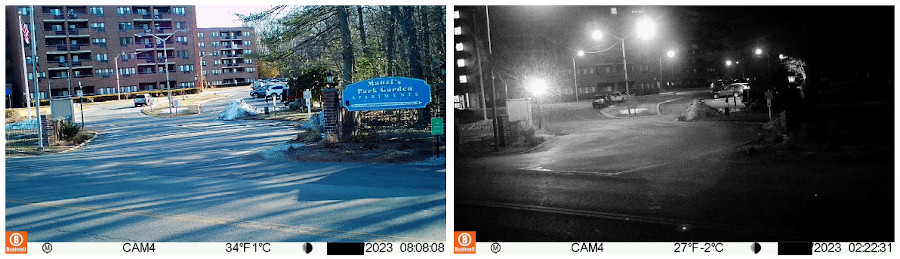

# MA trip generation

## Overview
This project aims to develop Massachusetts-specific trip generation models for land use projects. The primary focus is on utilizing location-based service (LBS) data to create accurate and efficient trip generation models, particularly for urban sites that benefit from proximity to public transportation. (Funding agency: MassDOT)

## Outputs
- [Final Report from mass.gov](https://www.mass.gov/doc/developing-massachusetts-specific-trip-generation-models-for-land-use-projects-final-report/download)
- [TRB RIP Link](https://rip.trb.org/view/1851848)
- [Research project statement](https://www.umasstransportationcenter.org/images/umtc/2021ResearchProjectStatements/Developing%20Massachusetts%20Specific%20Trip%20Generation%20Rates%20for%20Land%20Use%20Projects%20-%20Project%20Statement.pdf)


*Sample output showing vehicle count in specified direction.*


## Project Duration
March 2021 - September 2023

## Video Data Collection and Processing
- **Objective:** Develop Massachusetts-specific trip generation models using LBS data.
- **Methodology:** Utilize YOLOv8 Medium for object detection and tracking in RGB and IR traffic videos.
- **Significance:** Overcome limitations of traditional data collection methods, particularly for urban sites.
- Procedure developed for video data collection using trail cameras and automatic processing using AI algorithms.
- RGB and IR videos tested for vehicle detection and tracking.
- YOLOv8-Medium adopted for vehicle detection, with Deep-SORT algorithm for tracking.
- Results showed the feasibility and potential of using LBS data, with lower absolute percentage error compared to ITE estimates.


*Videos were collected from over 25 locations. Several thousand video clips were collected and processed. Training and inference was done using A100 and RTX 4090 GPUs.*




*Comparision of RGB and IR camera image quality.*


*Comparision of detections in RGB and IR camera videos at night.*


---

### Deep Learning model
- The YOLOv8 model was chosen for its balance between speed and accuracy in the context of the project.
- YOLOv8-Medium was used in the experiments, providing optimal results in terms of inference speed and model accuracy.
- Larger YOLOv8 models did not significantly outperform YOLOv8-Medium.

#### Link
[Bureau of Transportation Statistics- https://rosap.ntl.bts.gov/view/dot/72776](https://rosap.ntl.bts.gov/view/dot/72776)

```
Title : Developing Massachusetts-Specific Trip Generation Models for Land Use Projects
Creator(s) : Xie, Yuanchang;Loesch, Brandon;Bhuyan, Zubin;Logozzo, Francesco;Chen, Danjue;Liu, Benyuan (Ben);
Corporate Creator(s) : University of Massachusetts at Lowell
Corporate Contributor(s) : Massachusetts. Dept. of Transportation. Office of Transportation Planning;United States. Department of Transportation. Federal Highway Administration;
Contributor(s) : Lucien, Lionel
Published Date : 2023-09-01
Report Number : 23-046
URL : https://rosap.ntl.bts.gov/view/dot/72776
```
